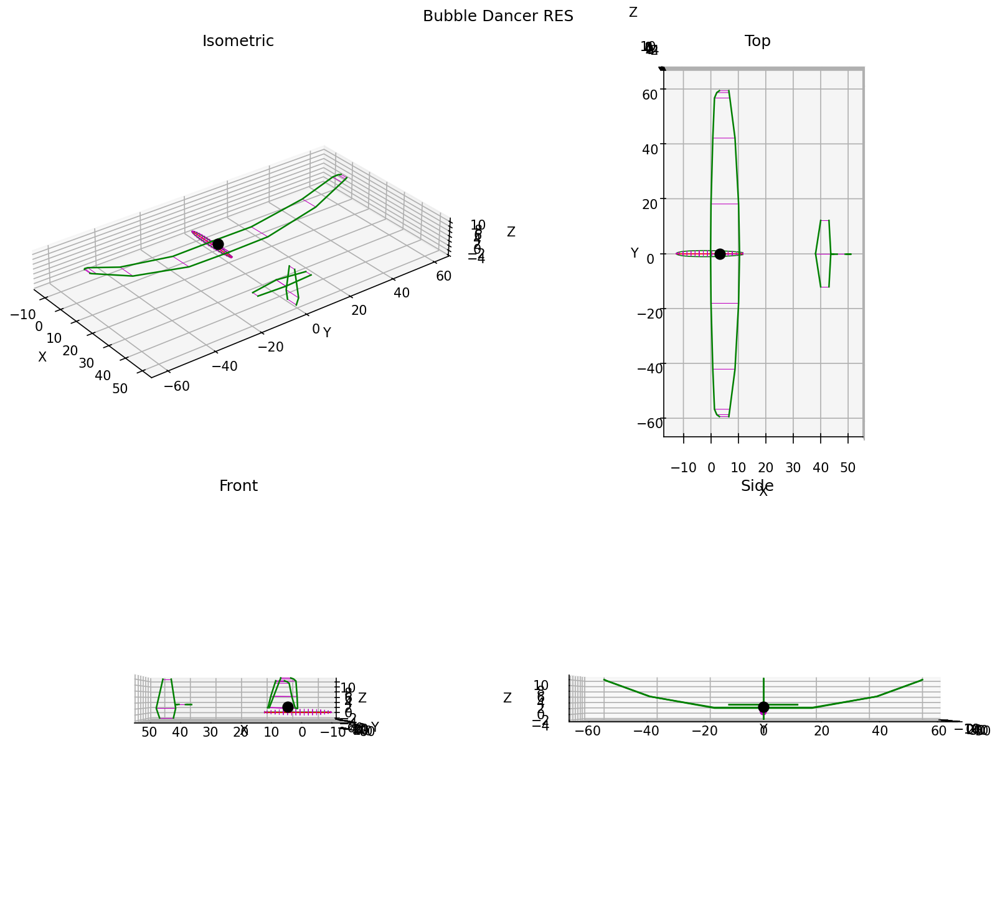
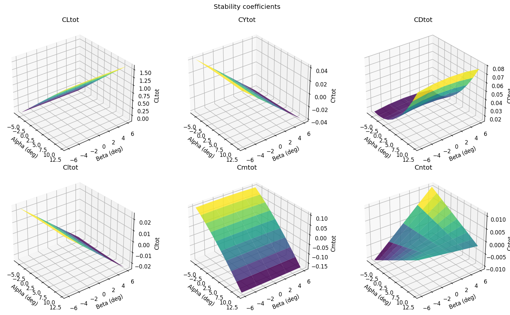
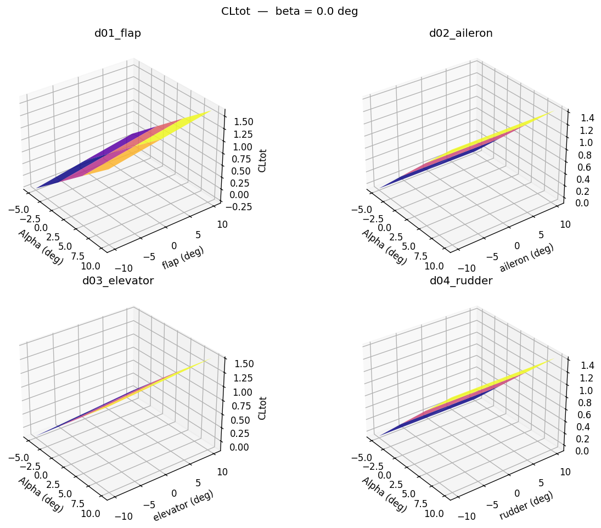

# Getting Started

## Installation

### 1. Install the AVL binary

AVL is a Fortran program distributed as source by MIT. Build it and place the binary at `~/bin/avl`.

#### macOS

```bash
brew install --cask xquartz   # X11 (required for AVL graphics mode)
brew install gcc               # provides gfortran
mkdir -p ~/bin
ln -sf /opt/homebrew/Cellar/gcc/15.2.0_1/bin/gfortran-15 ~/bin/gfortran
export PATH="$HOME/bin:$PATH"  # add to ~/.zshrc
```

:::{warning}
The gcc version in the symlink path (`15.2.0_1`) changes with each Homebrew update. Run `ls /opt/homebrew/Cellar/gcc/` to find the current version before copying the command.
:::

Download `avl3.52.tgz` from <https://web.mit.edu/drela/Public/web/avl/>, extract, then:

```bash
cd AVL3.52rel09032025
cd eispack && make -f Makefile.gfortran FC=~/bin/gfortran && cd ..
cd plotlib && cp config.make.gfortranDP config.make && make gfortranDP FC=~/bin/gfortran CC=/usr/bin/cc && cd ..
cd bin && make -f Makefile.gfortranDP FC=~/bin/gfortran
cp avl ~/bin/avl
```

#### Linux

```bash
sudo apt install gfortran libx11-dev   # Debian/Ubuntu
# sudo dnf install gcc-gfortran libX11-devel  # Fedora/RHEL
```

Then follow the same build steps above.

#### Windows

A pre-built binary is on the [AVL download page](https://web.mit.edu/drela/Public/web/avl/). Place it on your `PATH`.

#### Verify

```bash
avl-wrapper verify
# AVL 3.52 found at /Users/you/bin/avl — OK
```

:::{tip}
Run `avl-wrapper verify` after any system update or PATH change to confirm the binary is still reachable.
:::

### 2. Install the Python package

```bash
python3 -m venv .venv
source .venv/bin/activate      # macOS/Linux
# .venv\Scripts\activate       # Windows

pip install python-avl-wrapper
```

---

## Walkthrough: Bubble Dancer

`bd.avl` is a sailplane with four control surfaces — flap, aileron, elevator, and rudder. This walkthrough follows the full pipeline from geometry to aero database.

### Read and plot the geometry

```python
from avl_wrapper import avl_sweep_fileread, avl_fileplot

geom = avl_fileread("examples/bd.avl")

print(geom.header.name)          # Bubble Dancer RES
print(list(geom.surface.keys())) # ['Wing', 'Horizontal_tail', 'Vertical_tail']
print(geom.header.Sref)          # 1000.0  (reference area, sq-in)

fig = avl_fileplot(geom)
fig.savefig("bd_geometry.png", dpi=150)
```



### Run an alpha / beta sweep

```python
from avl_wrapper import avl_sweep

results = avl_sweep(
    avl_file="examples/bd.avl",
    alpha=list(range(-6, 13, 2)),   # -6 to +12 deg, 2 deg steps
    beta=[0.0],
)

print(f"{len(results)} cases computed")
for r in results[:3]:
    print(f"  Alpha={r.data['Alpha']:5.1f}  CLtot={r.data['CLtot']:.4f}")
```

```
10 cases computed
  Alpha= -6.0  CLtot=-0.1669
  Alpha= -4.0  CLtot=0.0311
  Alpha= -2.0  CLtot=0.2299
```

### Sweep control surfaces

```python
results = avl_sweep(
    avl_file="examples/bd.avl",
    alpha=[-4.0, 0.0, 4.0, 8.0],
    beta=[0.0],
    ctrl_sweeps={"elevator": [-10.0, -5.0, 0.0, 5.0, 10.0]},
)
print(f"{len(results)} cases (4 alpha × 5 elevator deflections)")
```

:::{note}
Surfaces in `ctrl_sweeps` are swept **independently**, not combinatorially. Two surfaces with five deflection points each produces 10 runs, not 25.
:::

### Build an aero database

```python
from avl_wrapper import aero_filewrite

results = avl_sweep(
    avl_file="examples/bd.avl",
    alpha=list(range(-6, 13, 2)),
    beta=[-6.0, -3.0, 0.0, 3.0, 6.0],
    ctrl_sweeps={"elevator": [-10.0, 0.0, 10.0]},
)

aero = aero_filewrite(results)

print(aero.stab["CLtot"].data.shape)               # (10, 5) — alpha × beta
print(aero.ctrl["CLtot_d03_elevator"].data.shape)  # (10, 5, 3) — alpha × beta × defl
```

:::{important}
Stability tables (`aero.stab`) are populated **only for neutral-control runs** (all deflections = 0). Include `0.0` in every `ctrl_sweeps` deflection list or stability tables will be empty.
:::

### Export results to a file

```python
# CSV — written to out/bd/results.csv  (default)
results = avl_sweep("examples/bd.avl", alpha=[-4, 0, 4], beta=[0])

# JSON
results = avl_sweep("examples/bd.avl", alpha=[-4, 0, 4], beta=[0], out_format="json")

# DataFrame only — no file written
results = avl_sweep("examples/bd.avl", alpha=[-4, 0, 4], beta=[0], out_format="df")
```

### Plot the aero database

```python
from avl_wrapper import aero_fileplot

figs = aero_fileplot(aero, beta_ref=0.0)
figs[0].savefig("bd_stab.png", dpi=150)   # stability coefficients
figs[1].savefig("bd_ctrl_CLtot.png", dpi=150)  # CLtot control derivatives
# figs[2..6] — CYtot, CDtot, Cltot, Cmtot, Cntot
```





### CLI

```bash
# Verify AVL binary is installed and reachable
avl-wrapper verify

# Pipe a hand-written command file directly to AVL stdin
avl-wrapper run my_commands.txt
```
